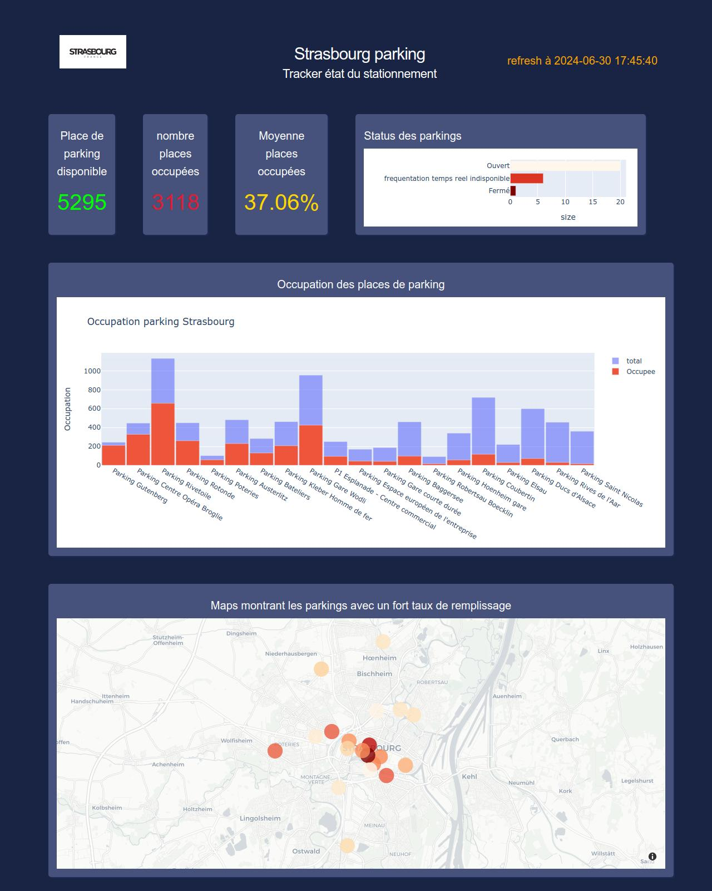

# 🚗 Strasbourg Parking Dashboard 🅿️

Welcome to the Strasbourg Parking Dashboard! This project is a web application that provides real-time information on the parking status in Strasbourg. The dashboard is built using Python and Plotly Dash and visualizes parking availability, occupancy rates, and the status of various parking facilities in the city.

You can access the live site here: [Strasbourg Parking Dashboard](https://dashboard-strasbourg-parking.onrender.com/)




## 🌟 Features

- **Real-time Parking Data**: Fetches and displays the latest data on parking availability and occupancy from Strasbourg's open data APIs.
- **Visualization**: Interactive bar charts and a scatter map to visualize parking data effectively.
- **Status Tracking**: Tracks the status of parking facilities (open, closed, or data unavailable).
- **Summary Cards**: Displays key statistics such as the number of available and occupied parking spaces, and the average occupancy rate.

## 🛠️ Getting Started

### 📋 Prerequisites

- Python 3.6 or higher
- The following Python libraries:
  - Dash
  - Plotly
  - Pandas
  - NumPy
  - Requests
  - JSON
  - Pytz

You can install the required libraries using pip:

```sh
pip install dash plotly pandas numpy requests pytz
```

### 🚀 Running the Application

1. Clone the repository

```sh
git clone https://github.com/yourusername/strasbourg-parking-dashboard.git
cd strasbourg-parking-dashboard
```

2. Install dependencies

```sh
pip install -r requirements.txt
```

3. Run the application

```sh
python app.py
```

4. Open your web browser and visit [http://127.0.0.1:8050/](http://127.0.0.1:8050/).

### 📁 Project Structure

```
.
├── app.py                   # Main application file
├── APi_parking_rouen.ipynb  # Jupyter Notebook for Rouen parking API
├── assets
│   ├── s1.css               # CSS file for styling
│   ├── style.css            # CSS file for styling
│   ├── strasbourg_logo.jpg  # Logo for the dashboard
│   └── Page_view.jpg        # Dashboard Page View Image
├── README.md                # This file
└── requirements.txt         # List of Python dependencies
```

### 📊 Data Sources

- **Parking Information**: [Strasbourg Open Data API](https://data.strasbourg.eu/api/explore/v2.1/catalog/datasets/parkings/records)
- **Real-Time Parking Data**: [Open Data Soft API](https://data.opendatasoft.com/api/explore/v2.1/catalog/datasets/occupation-parkings-temps-reel@eurometrostrasbourg/records)

### 🙏 Acknowledgments

This project was inspired by the [Covid-19 Dashboard in Python by Plotly Dash](https://github.com/Mubeen31/Covid-19-Dashboard-in-Python-by-Plotly-Dash).
